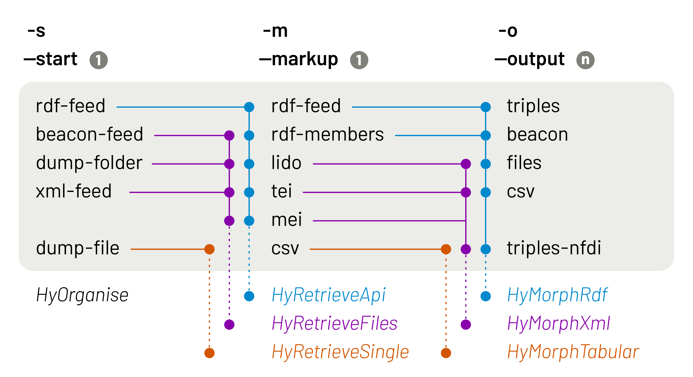

[](https://zenodo.org/badge/latestdoi/700253411)

# Hydra Scraper

**Comprehensive scraper for paginated APIs, Beacon files, and RDF file dumps**

This scraper provides a command-line toolset to pull data from various sources,
such as Hydra paginated APIs, Beacon files, or local file dumps. The tool
differentiates between feeds and their members in RDF-compatible formats such
as JSON-LD or Turtle, but it can also handle XML files using, for example, the
LIDO schema. Command-line calls can be combined and adapted to build
fully-fledged scraping mechanisms, including the ability to output a set of
triples. The script was originally developed as an API testing tool for of the
Corpus Vitrearum Germany (CVMA) at the Academy of Sciences and Literature
Mainz. It was later expanded to add functionality around the
[Culture Graph Interchange Format](https://docs.nfdi4culture.de/ta5-cgif-specification)
(CGIF) and the `nfdicore` ontology with the `cto` module.

## Licence

Written and maintained by [Jonatan Jalle Steller](mailto:jonatan.steller@adwmainz.de).

This code is covered by the [MIT](https://opensource.org/license/MIT/) licence.

## Workflows


## Installation

To use this script, make sure your system has a working `python` as well as
the packages `validators`, `rdflib`, and `lxml`. Then clone this repository (e.g. `git
clone https://github.com/digicademy/hydra-scraper.git` or the SSH equivalent).
Open a terminal in the resulting folder to run the script as described below.

## Usage

This scraper is a command-line tool. Use these main configuration options to
indicate what kind of scraping run you desire.

- `-s` or `--start <value>`: type of starting point for the scraping run:
  - `rdf-feed`: an RDF-based, optionally Hydra-paginated feed API or embedded metadata
  - `beacon-feed`: a local or remote text file listing one URL per line (Beacon)
  - `dump-folder`: a local folder of individual files
  - `xml-feed`: a local or remote XML file listing individual files (CMIF)
  - `dump-file`: a local file containing all information to process
- `-l` or `--location <url or folder or file>`: source URL, folder, or file path (depending on the start parameter)
- `-m` or `--markup <value>`: markup to query during the scraping run:
  - `rdf-feed`: use RDF triples contained in the feed
  - `rdf-members`: use RDF triples contained in individual feed members
  - `lido`: use LIDO files
  - `tei`: use TEI files
  - `mei`: use MEI files
  - `csv`: use a CSV file
- `-o` or `--output <value> <value>`: outputs to produce in the scraping run:
  - `beacon`: a text file listing one URL per line
  - `files`: the original files
  - `triples`: available triples
  - `triples-nfdi`: NFDI-style triples
  - `csv`: a CSV table of data

In addition, and depending on the main config, you can specify these
additional options:

- `-n` or `--name <string>`: name of the subfolder to download data to
- `-d` or `--dialect <string>`: content type to use for requests
- `-f` or `--filter <string>`: string to use as a filter for member/file URLs
- `-r` or `--replace <string>`: string to replace in member/file URLs
- `-rw` or `--replace_with <string>`: string to replace the previous one with
- `-a` or `--add <string>`: addition to the end of each member/file URL
- `-af` or `-add_feed <uri>`: URI of a data feed to bind members to
- `-ac` or `-add_catalog <uri>`: URI of a data catalog the data feed belongs to
- `-acp` or `-add_catalog_publisher <uri>`: URI of the publisher of the catalog
- `-c` or `--clean <string> <string>`: strings to remove from member/file URLs to build their file names
- `-t` or `--table <uri> <uri>`: property URIs to compile in a table
- `-q` or `--quiet`: avoid intermediate progress reporting

The possible combinations of `--start`, `--markup`, and `-output` commands may
be intricate as they are based on format limitations. The following figure
shows both the allowed combinations and the classes doing the heavy lifting.



## Examples

The commands listed below illustrate possible command-line arguments. They
refer to specific projects that use this script, but the commands should work
with any Hydra-paginated API in an RDF-comptabile format. Depending on your
operating system, you may need to use `python3` instead of `python`.

THE FOLLOWING EXAMPLES STILL NEED TO BE REVISED FOR THE REWRITE

### NFDI4Culture

Grab all **portal data** as triples:

```
python go.py \
-download resource_triples \
-source_url https://nfdi4culture.de/resource.ttl \
-target_folder n4c-turtle
```

Get **NFDI-style data** from an API entry point:

```
python go.py \
-download list_nfdi \
-source_url https://corpusvitrearum.de/cvma-digital/bildarchiv.html \
-target_folder sample-nfdi
```

Get **NFDI-style data from a Beacon** file:

```
python go.py \
-download resource_nfdi \
-source_file downloads/sample-nfdi/beacon.txt \
-target_folder sample-nfdi
```

Get **NFDI-style data from a Beacon** file that lists LIDO files:

```
python go.py \
-download resource_nfdi \
-source_file downloads/sample-nfdi/beacon.txt \
-content_type_xml lido \
-target_folder sample-nfdi \
-supplement_data_feed https://corpusvitrearum.de/cvma-digital/bildarchiv.html \
-supplement_data_catalog https://corpusvitrearum.de \
-supplement_data_catalog_publisher https://nfdi4culture.de/id/E1834
```

Get **NFDI-style data from a file dump**:

```
python go.py \
-download resource_nfdi \
-source_folder downloads/sample-nfdi \
-content_type application/ld+json \
-target_folder sample-nfdi
```

### Corpus Vitrearum Germany

All available **JSON-LD** data:

```
python go.py \
-download lists list_triples beacon resources resource_triples \
-source_url https://corpusvitrearum.de/id/about.json \
-target_folder cvma-jsonld \
-resource_url_filter https://corpusvitrearum.de/id/F \
-clean_resource_names https://corpusvitrearum.de/id/ /about.json
```

All available **RDF/XML** data:

```
python go.py \
-download lists list_triples beacon resources resource_triples \
-source_url https://corpusvitrearum.de/id/about.rdf \
-target_folder cvma-rdfxml \
-resource_url_filter https://corpusvitrearum.de/id/F \
-clean_resource_names https://corpusvitrearum.de/id/ /about.rdf
```

All available **Turtle** data:

```
python go.py \
-download lists list_triples beacon resources resource_triples \
-source_url https://corpusvitrearum.de/id/about.ttl \
-target_folder cvma-turtle \
-resource_url_filter https://corpusvitrearum.de/id/F \
-clean_resource_names https://corpusvitrearum.de/id/ /about.ttl
```

All available **CGIF (JSON-LD)** data:

```
python go.py \
-download lists list_triples list_nfdi beacon resources resource_triples resource_nfdi \
-source_url https://corpusvitrearum.de/id/about.cgif \
-target_folder cvma-nfdi \
-resource_url_filter https://corpusvitrearum.de/id/F \
-resource_url_add /about.cgif \
-clean_resource_names https://corpusvitrearum.de/id/ /about.cgif
```

All available **LIDO** data:

```
python go.py \
-download beacon resources \
-source_url https://corpusvitrearum.de/cvma-digital/bildarchiv.html \
-content_type_xml lido \
-target_folder cvma-lido \
-resource_url_add /about.lido \
-clean_resource_names https://corpusvitrearum.de/id/ /about.lido
```

All available **embedded metadata**:

```
python go.py \
-download lists list_triples list_nfdi beacon resources resource_triples resource_nfdi \
-source_url https://corpusvitrearum.de/cvma-digital/bildarchiv.html \
-target_folder cvma-embedded \
-clean_resource_names https://corpusvitrearum.de/id/
```

**Table** of specific metadata:

```
python go.py \
-download resource_table \
-source_url https://corpusvitrearum.de/id/about.json \
-target_folder cvma-jsonld \
-resource_url_filter https://corpusvitrearum.de/id/F \
-table_data http://purl.org/dc/elements/1.1/Title http://iptc.org/std/Iptc4xmpExt/2008-02-29/ProvinceState http://iptc.org/std/Iptc4xmpExt/2008-02-29/City http://iptc.org/std/Iptc4xmpExt/2008-02-29/Sublocation http://iptc.org/std/Iptc4xmpExt/2008-02-29/LocationId http://ns.adobe.com/exif/1.0/GPSLatitude http://ns.adobe.com/exif/1.0/GPSLongitude https://lod.academy/cvma/ns/xmp/AgeDeterminationStart https://lod.academy/cvma/ns/xmp/AgeDeterminationEnd https://lod.academy/cvma/ns/xmp/IconclassNotation
```

Table of specific metadata **from an existing dump**:

```
python go.py \
-download resource_table \
-source_folder downloads/cvma-jsonld/resources \
-content_type application/ld+json \
-target_folder cvma-jsonld \
-table_data http://purl.org/dc/elements/1.1/Title http://iptc.org/std/Iptc4xmpExt/2008-02-29/ProvinceState http://iptc.org/std/Iptc4xmpExt/2008-02-29/City http://iptc.org/std/Iptc4xmpExt/2008-02-29/Sublocation http://iptc.org/std/Iptc4xmpExt/2008-02-29/LocationId http://ns.adobe.com/exif/1.0/GPSLatitude http://ns.adobe.com/exif/1.0/GPSLongitude https://lod.academy/cvma/ns/xmp/AgeDeterminationStart https://lod.academy/cvma/ns/xmp/AgeDeterminationEnd https://lod.academy/cvma/ns/xmp/IconclassNotation
```

## Contributing

The file `go.py` provides the basic logic of a scraping run. It instantiates three types of objects:

1. A `HyOrganise` object collects and cleans configuration info. It also provides methods to report the current or final status of a scraping run.
2. Using information from this object, a `HyRetrieve` object is used to download and store markup, based on the `--start` parameter: `HyRetrieveApi` queries an endpoint, `HyRetrieveFiles` produces dumps of individual files, whereas `HyRetrieveSingle` processes single-file content.
3. With the same `HyOrganise` info as before, a `HyMorph` object is called to produce the required output based on what markup is to be used: `HyMorphRdf` handles RDF feeds and resources, `HyMorphXml` deals with XML-based schemas, and `HyMorphTabular` handles data tables. These classes differ in what output they are able to produce due to the input formats they serve.

If you change the code, please remember to document each function and walk other users or maintainers through significant steps. This package is governed by the [Contributor Covenant](https://www.contributor-covenant.org/de/version/1/4/code-of-conduct/) code of conduct. Please keep this in mind in all interactions.

## Releasing

Before you make a new release, make sure the following files are up to date:

- `CHANGELOG.md`: version number and changes
- `CITATION.cff`: version number, authors, and release date
- `requirements.txt`: list of required libraries
- `setup.py`: version number and authors

Use GitHub to make the release. Use semantic versioning.

## Roadmap

- Add CMIF, TEI, and MEI support
- Add `HyRetrieveSingle` and `HyMorphTabular` to support CSV data

**Further options**

- Possibly switch LIDO support to `epoz/lidolator` and nfdicore/cto support to `epoz/nfdi4culture_python_package` after contributing features
- Possibly use the system's download folder to actually distribute the package
- Possibly release the package on PyPI
- Find a lightweight way to periodically update the schema.org class lists in the `cto` library
