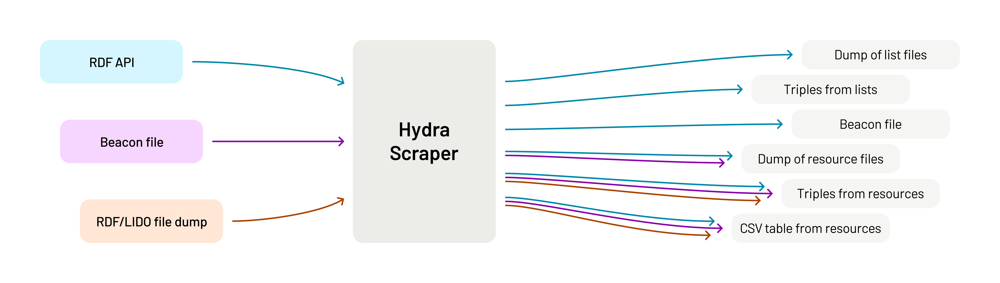

[](https://zenodo.org/badge/latestdoi/700253411)

# Hydra Scraper

**Comprehensive scraper for paginated APIs, RDF, XML, file dumps, and Beacon files**

This scraper provides a command-line toolset to pull data from various sources,
such as Hydra paginated schema.org APIs, Beacon files, or file dumps. The tool
differentiates between feeds and their elements in RDF-compatible formats such
as JSON-LD or Turtle, but it can also handle XML files using, for example, the
LIDO schema. Command-line calls can be combined and adapted to build
fully-fledged scraping mechanisms, including the ability to output a set of
triples. The script was originally developed as an API testing tool for of the
Corpus Vitrearum Germany (CVMA) at the Academy of Sciences and Literature
Mainz. It was later expanded for use in the Culture Knowledge Graph at
[NFDI4Culture](https://nfdi4culture.de/) around the
[Culture Graph Interchange Format (CGIF)](https://docs.nfdi4culture.de/ta5-cgif-specification)
and the NFDIcore ontology with the CTO module.

## Licence

Written and maintained by [Jonatan Jalle Steller](mailto:jonatan.steller@adwmainz.de).

This code is covered by the [MIT](https://opensource.org/license/MIT/) licence.

## Workflows



## Installation

To use this script, make sure your Python environment has the packages listed
in `requirements.txt`. Then clone this repository (e.g.
`git clone https://github.com/digicademy/hydra-scraper.git` or the SSH
equivalent). Open a terminal in the resulting folder to run the script as
described in the "Examples" section below.

## Usage

The scraper is a command-line tool. Use these main configuration options to
indicate what kind of scraping run you desire.

- `-l` or `--location <url or folder or file>`: source URI, folder, or file path
- `-f` or `--feed <value>`: type of feed or starting point for the scraping run:
  - `beacon`: a local or remote text file listing one URI per line (Beacon)
  - `cmif`: a local or remote CMIF file
  - `folder`: a local folder of individual feed element files
  - `schema`: an RDF-based, optionally Hydra-paginated schema.org API or embedded metadata (CGIF)
  - `schema-list`: same as above, but using the triples in individual schema.org files
  - `zipped`: a ZIP-compressed folder of individual files
- `-e` or `--elements <value>`: element markup to extract data from during the scraping run (leave out to not extract data):
  - `lido`: use LIDO files
  - `schema`: use RDF triples in a schema.org format (CGIF)
- `-o` or `--output <value> <value>`: outputs to produce in the scraping run:
  - `files`: the original files
  - `triples`: the original triples
  - `beacon`: a text file listing one URI per line
  - `csv`: a CSV table of data
  - `cto`: NFDI4Culture-style triples

In addition, and depending on the main config, you can specify these
additional options:

- `-n` or `--name <string>`: name of the subfolder to download data to
- `-d` or `--dialect <string>`: content type to use for requests
- `-i` or `--include <string>`: filter for feed element URIs to include
- `-r` or `--replace <string>`: string to replace in feed element URIs
- `-rw` or `--replace_with <string>`: string to replace the previous one with
- `-a` or `--append <string>`: addition to the end of each feed element URI
- `-af` or `-add_feed <uri>`: URI of a data feed to bind members to
- `-ac` or `-add_catalog <uri>`: URI of a data catalog the data feed belongs to
- `-ap` or `-add_publisher <uri>`: URI of the data publisher
- `-c` or `--clean <string> <string>`: strings to remove from feed element URIs to build their file names
- `-p` or `--prepare <string>`: prepare cto output for this NFDI4Culture feed ID
- `-q` or `--quiet`: do not display status messages

## Examples

The commands listed below illustrate possible command-line arguments. They
refer to specific projects that use this scraper, but the commands should work
with any other page using the indicated formats. Depending on your operating
system, you may need to use `python3` instead of `python`.

### NFDI4Culture

Original triples from the **Culture Information Portal**:

```bash
python go.py -l https://nfdi4culture.de/resource.ttl -f schema-list -o triples -n n4c-portal
```

NFDIcore/CTO triples from a local or remote **CGIF/schema.org feed (embedded)**:

```bash
python go.py -l https://corpusvitrearum.de/cvma-digital/bildarchiv.html -f schema -e schema -o cto -n n4c-cgif -p E5308
```

NFDIcore/CTO triples from a local or remote **CGIF/schema.org feed (API)**:

```bash
python go.py -l https://gn.biblhertz.it/fotothek/seo -f schema -e schema -o cto -n n4c-cgif-api -p E4244
```

NFDIcore/CTO triples from a local or remote **Beacon-like feed of CGIF/schema.org files**:

```bash
python go.py -l downloads/n4c-cgif/beacon.txt -f beacon -e schema -o cto -n n4c-cgif-beacon -a /about.cgif -p E5308
```

NFDIcore/CTO triples from a local or remote **Beacon-like feed of LIDO files** (feed URI added because it is not in the data):

```bash
python go.py -l downloads/n4c-cgif/beacon.txt -f beacon -e lido -o cto -n n4c-lido -a /about.lido -af https://corpusvitrearum.de/cvma-digital/bildarchiv.html -p E5308
```

### Corpus Vitrearum Germany

Files and triples from **JSON-LD** data:

```bash
python go.py -l https://corpusvitrearum.de/id/about.json -f schema-list -o files triples -n cvma-jsonld -i https://corpusvitrearum.de/id/F -c https://corpusvitrearum.de/id/ /about.json
```

Files and triples from **RDF/XML** data:

```bash
python go.py -l https://corpusvitrearum.de/id/about.rdf -f schema-list -o files triples -n cvma-rdfxml -i https://corpusvitrearum.de/id/F -c https://corpusvitrearum.de/id/ /about.rdf
```

Files and triples from **Turtle** data:

```bash
python go.py -l https://corpusvitrearum.de/id/about.ttl -f schema-list -o files triples -n cvma-turtle -i https://corpusvitrearum.de/id/F -c https://corpusvitrearum.de/id/ /about.ttl
```

Beacon, CSV table, NFDIcore/CTO, files, and triples from **CGIF/schema.org (embedded)** data:

```bash
python go.py -l https://corpusvitrearum.de/cvma-digital/bildarchiv.html -f schema -e schema -o beacon csv cto files triples -n cvma-cgif -p E5308 -c https://corpusvitrearum.de/id/
```

Beacon, CSV table, NFDIcore/CTO, files, and triples from **CGIF/schema.org (API)** data:

```bash
python go.py -l https://corpusvitrearum.de/id/about.cgif -f schema -e schema -o beacon csv cto files triples -n cvma-cgif-api -p E5308
```

Beacon, CSV table, NFDIcore/CTO, and files from **LIDO** data:

```bash
python go.py -l https://corpusvitrearum.de/cvma-digital/bildarchiv.html -f schema-list -e lido -o beacon csv cto files -n cvma-lido -a /about.lido -c https://corpusvitrearum.de/id/ /about.lido
```

## Contributing

The file `go.py` executes a regular scraping run via several `base` modules that can also be used independently:

1. `organise` provides the `Organise` object to collect and clean configuration info. It also creates the required folders and sets up logging.
2. `job` provides the `Job` object to orchestrate a single scraping run. It contains the feed pagination and data collation logic.
3. `file` provides the `File` object to retrieve a remote or local file. It also contains logic to identify file types and parse RDF or XML.
4. `data` provides the data storage objects `Uri`, `UriList`, `Label`, `LabelList`, `UriLabel`, `UriLabelList`, `Date`, `DateList`, and `Incipit`. They include data serialisation logic and namespace normalization.
5. `extract` is a special module to provide `ExtractFeedInterface` and `ExtractFeedElementInterface`. These include generic functions to extract XML or RDF data.
6. `map` is another special module to provide `MapFeedInterface` and `MapFeedElementInterface`. These include generic functions to generate text content or RDF triples.
7. `lookup` provides a `Lookup` object as well as type lists for authority files. These can be used to identify whether a URI refers to a person, an organisation, a location, an event, or something else.

Two additional sets of classes use the `extract` and `map` interfaces to provide extraction and mapping routines for particular formats. These routines provide a `Feed` and/or a `FeedElement` object depending on what the format provides. These format-specific objects are called from the `Job` object listed above.

If you change the code, please remember to document each object/function and walk other users or maintainers through significant steps. This package is governed by the [Contributor Covenant](https://www.contributor-covenant.org/de/version/1/4/code-of-conduct/) code of conduct. Please keep this in mind in all interactions.

## Releasing

Before you make a new release, make sure the following files are up to date:

- `CHANGELOG.md`: version number and changes
- `CITATION.cff`: version number, authors, and release date
- `requirements.txt`: list of required libraries
- `setup.py`: version number and authors
- `base/organise.py`: version number

Use GitHub to make the release. Use semantic versioning.

## Roadmap

- Expand `lookup` to become a look-up module plus a local storage file to speed up consecutive harvests
- Allow for remote/local ZIP and local folder ingests (and alter this readme)
- Update `assets` folder and release

**Likely after 0.9.0**

- Implement job presets/collections
- Convert `test.py` to something more sophisticated
- Optional OCI container
- Add TEI ingest support based on [Gregorovius](https://gregorovius-edition.dhi-roma.it/api/cmif)
- Add [OAI-PMH](https://pro.deutsche-digitale-bibliothek.de/daten-nutzen/schnittstellen) ingest support
- Add MEI ingest support
- Add DCAT serialisation
- Add support for ingesting CSV/JSON data?

**Further ideas**

- Use the system's download folder to be able to distribute the package
- Fix setup file and release the package on PyPI
- Find a lightweight way to periodically update the RDF class lists
